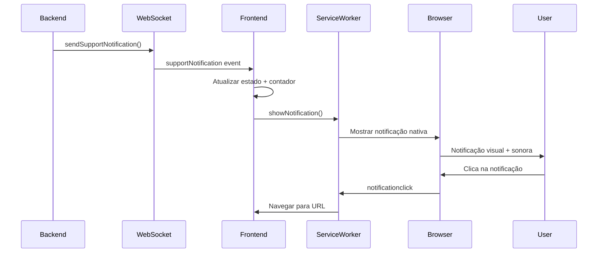

# Sistema de Notificações Web Push - Gringo Delivery

## Visão Geral

O sistema de notificações implementado permite enviar notificações push para o navegador dos usuários, similar às notificações push de aplicativos mobile. As notificações funcionam mesmo quando a aba do navegador não está aberta, utilizando Service Workers.

## Características

✅ **Notificações Push Nativas**: Usando Web Notifications API
✅ **Service Worker**: Funciona em background, mesmo com aba fechada  
✅ **Integração WebSocket**: Notificações em tempo real via Socket.io
✅ **Múltiplos Tipos**: Suporte, sistema, alertas, etc.
✅ **Controle de Permissões**: Gerenciamento automático de permissões
✅ **Customização**: Diferentes estilos por tipo de notificação
✅ **Navegação Inteligente**: Clique nas notificações navega para página apropriada

## Arquitetura

```
Frontend (React)
├── webPushService.js         # Serviço principal de notificações push
├── sw-notifications.js       # Service Worker para background
├── useSocketNotifications.js # Hook para WebSocket + Push integration
├── SupportNotifications.js   # Interface de gerenciamento
└── NotificationIndicator.js  # Badge com contador

Backend (Node.js)
├── serverSocketExample.js    # Servidor com Socket.io configurado
├── routes/notificationRoutes # Rotas para notificações
└── socket/socketHandler.js   # Handlers WebSocket
```

## Como Funciona

### 1. Inicialização

```javascript
// O webPushService automaticamente:
// 1. Verifica se notificações são suportadas
// 2. Registra o Service Worker
// 3. Solicita permissão do usuário
// 4. Configura listeners para cliques
import webPushService from "../services/webPushService";

await webPushService.initialize();
```

### 2. Enviando Notificações do Backend

#### Notificação de Suporte

```javascript
// Função global disponível no servidor
sendSupportNotification(
  firebaseUid,
  "🚨 Nova Ocorrência Urgente",
  "Uma ocorrência de alta prioridade foi atribuída a você",
  {
    occurrenceId: "123",
    priority: "high",
    url: "/occurrences/123",
  }
);
```

#### Notificação de Sistema

```javascript
sendSystemNotification(
  firebaseUid,
  "🖥️ Atualização do Sistema",
  "O sistema será atualizado em 10 minutos",
  {
    maintenanceWindow: "2024-01-15T02:00:00Z",
  }
);
```

#### Via API REST

```bash
# Testar notificação de suporte
curl -X POST http://localhost:8080/api/test/support-notification \
  -H "Content-Type: application/json" \
  -d '{
    "firebaseUid": "user123",
    "title": "Teste de Notificação",
    "message": "Esta é uma notificação de teste",
    "data": {"test": true}
  }'
```

### 3. Interface de Usuário

#### Página de Notificações

- **Visualização**: Lista de todas as notificações
- **Controles Push**: Liga/desliga notificações push
- **Status Connection**: Indicador de conexão WebSocket
- **Teste**: Botão para testar notificações

#### Indicador no Menu

- **Badge**: Contador de notificações não lidas
- **Tempo Real**: Atualização automática via WebSocket

## Fluxo de Notificação



## Tipos de Notificação

### 1. Suporte (`support`)

- **Uso**: Ocorrências, tickets, alertas da equipe
- **Características**: Requer interação, alta prioridade
- **Ícone**: Logo da empresa
- **Som**: Ativo

### 2. Sistema (`system`)

- **Uso**: Manutenções, atualizações, status
- **Características**: Informativo, média prioridade
- **Ícone**: Ícone de sistema
- **Som**: Ativo

### 3. Alertas (`alert`)

- **Uso**: Situações urgentes, problemas críticos
- **Características**: Alta prioridade, vibração
- **Ícone**: Ícone de alerta
- **Som**: Ativo + vibração

## Configuração de Permissões

### Automática

```javascript
// O sistema solicita automaticamente quando habilitado
const granted = await webPushService.requestPermission();
if (granted) {
  console.log("✅ Notificações habilitadas!");
}
```

### Status de Permissões

- `default`: Usuário ainda não decidiu
- `granted`: Permissão concedida
- `denied`: Permissão negada

### Tratamento de Negação

```javascript
if (Notification.permission === "denied") {
  // Mostrar instruções para reabilitar nas configurações do navegador
  console.log("❌ Notificações bloqueadas - instruir usuário");
}
```

## Service Worker

### Recursos

- **Background Processing**: Funciona mesmo com aba fechada
- **Cache de Notificações**: Evita duplicatas
- **Navegação Inteligente**: Roteamento baseado no tipo
- **Cleanup Automático**: Limpeza periódica de cache

### Eventos Tratados

```javascript
// Service Worker escuta automaticamente:
self.addEventListener("push", handlePushEvent); // Notificações push
self.addEventListener("notificationclick", handleClick); // Cliques
self.addEventListener("notificationclose", handleClose); // Fechamento
```

## Compatibilidade

### Navegadores Suportados

- ✅ Chrome 42+
- ✅ Firefox 44+
- ✅ Safari 16+
- ✅ Edge 17+
- ❌ Internet Explorer (não suportado)

### Recursos Necessários

- **HTTPS**: Obrigatório para Service Workers
- **Permissions API**: Para controle de permissões
- **Notifications API**: Para mostrar notificações

## Debugging

### Console Logs

```javascript
// Ativar logs detalhados
localStorage.setItem("debug", "true");

// Logs incluem:
console.log("🔔 Nova notificação recebida");
console.log("📱 Service Worker registrado");
console.log("✅ Permissão concedida");
```

### Ferramentas de Desenvolvimento

1. **Application > Service Workers**: Status do SW
2. **Application > Notifications**: Permissões
3. **Console**: Logs de debug
4. **Network**: Conexões WebSocket

### Testes

```javascript
// Testar notificação
webPushService.testNotification();

// Verificar suporte
console.log("Suportado:", webPushService.isSupported());

// Verificar permissão
console.log("Permissão:", webPushService.hasPermission());
```

## Exemplos de Uso

### 1. Sistema de Ocorrências

```javascript
// Quando nova ocorrência é criada
app.post("/api/occurrences", async (req, res) => {
  const occurrence = await createOccurrence(req.body);

  // Notificar responsável
  sendSupportNotification(
    occurrence.assignedTo,
    "📋 Nova Ocorrência Atribuída",
    `Ocorrência #${occurrence.id}: ${occurrence.title}`,
    {
      occurrenceId: occurrence.id,
      priority: occurrence.priority,
      url: `/occurrences/${occurrence.id}`,
    }
  );

  res.json(occurrence);
});
```

### 2. Sistema Financeiro

```javascript
// Notificar sobre pagamento
sendSystemNotification(
  userId,
  "💰 Pagamento Processado",
  `Seu pagamento de R$ ${amount} foi processado com sucesso`,
  {
    paymentId: payment.id,
    amount: payment.amount,
    url: `/finance/payments/${payment.id}`,
  }
);
```

### 3. Monitoramento de Sistema

```javascript
// Alerta de sistema
sendSupportNotification(
  adminUserId,
  "🚨 Sistema Sobrecarregado",
  "CPU está em 95%. Ação imediata necessária.",
  {
    type: "system_alert",
    severity: "critical",
    metrics: { cpu: 95, memory: 80 },
    url: "/admin/monitoring",
  }
);
```

## Próximos Passos

### Implementar

1. **Push Server**: Servidor dedicado para push notifications
2. **Clustering**: Suporte a múltiples instâncias do servidor
3. **Analytics**: Tracking de visualizações e cliques
4. **A/B Testing**: Diferentes estilos de notificação
5. **Scheduler**: Notificações agendadas

### Melhorias

1. **Rich Notifications**: Imagens, botões customizados
2. **Grouping**: Agrupar notificações similares
3. **Quiet Hours**: Respeitar horários do usuário
4. **Personalization**: Preferências por tipo
5. **Offline Support**: Queue para quando offline

## Troubleshooting

### Notificações não aparecem

1. Verificar permissões no navegador
2. Confirmar HTTPS habilitado
3. Verificar Service Worker registrado
4. Checar console para erros

### Service Worker não registra

1. Verificar caminho do arquivo `/sw-notifications.js`
2. Confirmar HTTPS
3. Verificar sintaxe do Service Worker
4. Limpar cache do navegador

### WebSocket não conecta

1. Verificar URL do servidor
2. Confirmar porta correta (8080)
3. Verificar configurações CORS
4. Testar conexão manual

---

**Desenvolvido para Gringo Delivery** 🚚
_Sistema de notificações web moderno e confiável_
