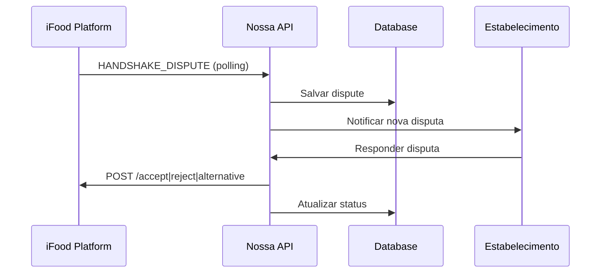
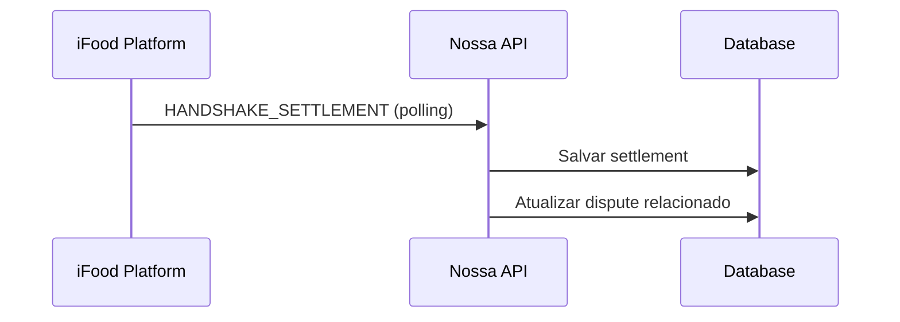

# Sistema de Negociação de Pedidos iFood - API Documentation

Este documento descreve a implementação completa do sistema de negociação de pedidos conforme especificação da Plataforma de Negociação de Pedidos do iFood.

## 📋 Visão Geral

O sistema implementa os 5 passos especificados:

1. ✅ **Mapeamento das entidades** - HandshakeDispute, HandshakeSettlement e entidades relacionadas
2. ✅ **Consumo de eventos** - Polling dos eventos HANDSHAKE_DISPUTE e HANDSHAKE_SETTLEMENT
3. ✅ **Integração REST API** - Endpoints /accept, /reject e /alternative
4. ✅ **Processamento HANDSHAKE_DISPUTE** - Resposta obrigatória com timeout automático
5. ✅ **Processamento HANDSHAKE_SETTLEMENT** - Registro de conclusão da negociação

## 🗂️ Modelos de Dados

### HandshakeDispute

Representa uma disputa recebida que requer resposta do merchant.

```javascript
{
  eventId: String,           // ID único do evento
  orderId: String,           // ID do pedido em disputa
  disputeId: String,         // ID da disputa
  merchantId: String,        // ID do merchant
  storeFirebaseUid: String,  // UID da loja no Firebase
  disputeType: String,       // QUALITY | MISSING_ITEMS | WRONG_ITEMS | DELAY | OTHER
  description: String,       // Descrição da disputa
  customerComplaint: String, // Reclamação do cliente
  media: [MediaSchema],      // Evidências (fotos, documentos)
  disputedItems: [ItemSchema], // Itens em disputa
  availableAlternatives: [DisputeAlternativeSchema], // Alternativas disponíveis
  status: String,            // PENDING | ACCEPTED | REJECTED | COUNTER_PROPOSED | SETTLED | EXPIRED
  expiresAt: Date,          // Data/hora limite para resposta
  merchantResponse: {        // Resposta do merchant
    type: String,            // ACCEPT | REJECT | ALTERNATIVE
    reason: String,          // Motivo (para REJECT)
    proposedAlternative: Object, // Contraproposta (para ALTERNATIVE)
    respondedBy: String      // Quem respondeu
  }
}
```

### HandshakeSettlement

Representa o resultado final de uma negociação.

```javascript
{
  eventId: String,
  orderId: String,
  disputeId: String,
  merchantId: String,
  storeFirebaseUid: String,
  originalDisputeEventId: String,
  settlementResult: String,  // ACCEPTED | REJECTED | ALTERNATIVE_ACCEPTED | AUTOMATIC_TIMEOUT
  settlementDetails: {
    type: String,           // REFUND | PARTIAL_REFUND | REPLACEMENT | VOUCHER | CUSTOM | NO_ACTION
    description: String,
    amount: AmountSchema,
    items: [ItemSchema]
  },
  financialImpact: {
    merchantLiability: AmountSchema,
    platformLiability: AmountSchema,
    customerCompensation: AmountSchema
  },
  negotiationTimeline: {
    disputeCreatedAt: Date,
    merchantRespondedAt: Date,
    settlementReachedAt: Date,
    totalNegotiationTime: Number // em minutos
  }
}
```

## 🔄 Fluxo de Eventos

### 1. Recebimento de HANDSHAKE_DISPUTE



### 2. Recebimento de HANDSHAKE_SETTLEMENT



## 🛠️ Endpoints da API

### Disputes

#### `GET /api/handshake/disputes/pending`

Lista disputes pendentes para o estabelecimento autenticado.

**Headers:**

```
Authorization: Bearer <firebase-token>
```

**Response:**

```json
{
  "success": true,
  "data": [
    {
      "disputeId": "dispute_123",
      "orderId": "order_456",
      "disputeType": "QUALITY",
      "description": "Produto chegou frio",
      "timeRemainingMinutes": 45,
      "isUrgent": true,
      "isCritical": false,
      "expiresAt": "2025-09-02T15:30:00Z"
    }
  ],
  "count": 1
}
```

#### `GET /api/handshake/disputes/:disputeId`

Obtém detalhes de uma disputa específica.

**Response:**

```json
{
  "success": true,
  "data": {
    "disputeId": "dispute_123",
    "orderId": "order_456",
    "disputeType": "QUALITY",
    "description": "Produto chegou frio",
    "customerComplaint": "A comida estava fria quando chegou",
    "media": [
      {
        "url": "https://example.com/photo.jpg",
        "type": "IMAGE",
        "description": "Foto do produto"
      }
    ],
    "disputedItems": [
      {
        "id": "item_789",
        "name": "Pizza Margherita",
        "quantity": 1,
        "price": { "value": 25.9, "currency": "BRL" }
      }
    ],
    "availableAlternatives": [
      {
        "type": "REFUND",
        "description": "Reembolso total"
      },
      {
        "type": "PARTIAL_REFUND",
        "description": "Reembolso parcial",
        "amount": { "value": 12.95, "currency": "BRL" }
      }
    ],
    "timeRemainingMinutes": 45,
    "canRespond": true
  }
}
```

#### `POST /api/handshake/disputes/:disputeId/accept`

Aceita uma disputa.

**Headers:**

```
Authorization: Bearer <firebase-token>
```

**Response:**

```json
{
  "success": true,
  "message": "Disputa aceita com sucesso",
  "data": {
    "disputeId": "dispute_123",
    "responseType": "ACCEPT",
    "timestamp": "2025-09-02T14:30:00Z"
  }
}
```

#### `POST /api/handshake/disputes/:disputeId/reject`

Rejeita uma disputa.

**Headers:**

```
Authorization: Bearer <firebase-token>
```

**Body:**

```json
{
  "reason": "Produto foi entregue dentro das especificações e temperatura adequada"
}
```

**Response:**

```json
{
  "success": true,
  "message": "Disputa rejeitada com sucesso",
  "data": {
    "disputeId": "dispute_123",
    "responseType": "REJECT",
    "timestamp": "2025-09-02T14:30:00Z"
  }
}
```

#### `POST /api/handshake/disputes/:disputeId/alternative`

Envia uma contraproposta.

**Headers:**

```
Authorization: Bearer <firebase-token>
```

**Body:**

```json
{
  "alternative": {
    "type": "PARTIAL_REFUND",
    "description": "Oferecemos 50% de reembolso devido ao problema relatado",
    "amount": {
      "value": 12.95,
      "currency": "BRL"
    }
  }
}
```

**Response:**

```json
{
  "success": true,
  "message": "Contraproposta enviada com sucesso",
  "data": {
    "disputeId": "dispute_123",
    "responseType": "ALTERNATIVE",
    "timestamp": "2025-09-02T14:30:00Z"
  }
}
```

### Histórico e Relatórios

#### `GET /api/handshake/history`

Obtém histórico de negociações.

**Query Parameters:**

- `limit`: Número máximo de resultados (padrão: 50)
- `skip`: Número de resultados a pular (padrão: 0)
- `status`: Filtrar por status
- `startDate`: Data de início (ISO format)
- `endDate`: Data de fim (ISO format)

**Response:**

```json
{
  "success": true,
  "data": {
    "disputes": [...],
    "settlements": [...],
    "summary": {
      "disputes": {
        "total": 25,
        "pending": 3,
        "resolved": 22,
        "resolutionRate": "88.0"
      },
      "settlements": {
        "total": 22,
        "accepted": 18,
        "rejected": 4,
        "acceptanceRate": "81.8"
      },
      "financialImpact": {
        "totalLiability": 150.50,
        "currency": "BRL"
      }
    }
  }
}
```

#### `GET /api/handshake/summary`

Obtém resumo das negociações do estabelecimento.

### Utilitários

#### `POST /api/handshake/disputes/check-expired`

Força verificação de disputes expirados (admin).

#### `GET /api/handshake/disputes/default-responses/:disputeType`

Obtém sugestões de resposta baseadas no tipo de disputa.

**Response:**

```json
{
  "success": true,
  "data": {
    "accept": "Aceitamos a reclamação sobre a qualidade do produto...",
    "reject": "Após análise, não identificamos problemas na qualidade...",
    "alternative": {
      "type": "PARTIAL_REFUND",
      "description": "Oferecemos reembolso parcial devido à questão..."
    }
  }
}
```

#### `POST /api/handshake/disputes/validate-alternative`

Valida dados de contraproposta antes do envio.

**Body:**

```json
{
  "alternative": {
    "type": "PARTIAL_REFUND",
    "amount": { "value": 12.95, "currency": "BRL" }
  }
}
```

**Response:**

```json
{
  "success": true,
  "data": {
    "isValid": true,
    "errors": []
  }
}
```

## ⚙️ Configuração de Serviços

### IfoodService - Integração com iFood

O `IfoodService` foi estendido para incluir:

- Processamento automático de eventos HANDSHAKE_DISPUTE e HANDSHAKE_SETTLEMENT
- Endpoints para accept, reject e alternative
- Gerenciamento de autenticação e tokens
- Tratamento de erros específicos de negociação

### HandshakeNegotiationService - Lógica de Negociação

Gerencia toda a lógica de negociação:

- Validação de respostas
- Verificação de expiração
- Geração de relatórios
- Sugestões de resposta padrão

### HandshakeMonitoringService - Monitoramento Automático

Serviço de monitoramento em background:

- **Verificação de expiração**: A cada 5 minutos
- **Relatório diário**: Todos os dias às 9h
- **Limpeza de dados**: Domingos às 3h

## 🔒 Autenticação e Autorização

Todos os endpoints requerem autenticação via Firebase Token:

```
Authorization: Bearer <firebase-token>
```

O token é validado e o `storeFirebaseUid` é extraído para filtrar dados específicos do estabelecimento.

## ⚠️ Tratamento de Erros

### Códigos de Status HTTP

- **200**: Sucesso
- **400**: Dados inválidos ou faltantes
- **401**: Token não fornecido
- **403**: Token inválido
- **404**: Recurso não encontrado
- **500**: Erro interno do servidor

### Exemplos de Erro

```json
{
  "success": false,
  "message": "Motivo da rejeição é obrigatório",
  "error": "Validation error"
}
```

```json
{
  "success": false,
  "message": "Dados da contraproposta são inválidos",
  "errors": [
    "Tipo da alternativa é obrigatório",
    "Valor é obrigatório para reembolso parcial"
  ]
}
```

## 📊 Monitoramento e Logs

### Logs do Sistema

Todos os eventos são logados com prefixos específicos:

- `[IFOOD]`: Eventos relacionados à API do iFood
- `[HANDSHAKE]`: Operações de negociação
- `[HANDSHAKE MONITOR]`: Monitoramento automático

### Métricas Importantes

- Taxa de resolução de disputes
- Tempo médio de resposta
- Tipos de disputa mais comuns
- Valor total de responsabilidade financeira

## 🚀 Deploy e Inicialização

O sistema é iniciado automaticamente com o servidor:

```javascript
// No server.js
const handshakeMonitoringService = new HandshakeMonitoringService();
handshakeMonitoringService.start();
```

### Variáveis de Ambiente Necessárias

```env
IFOOD_CLIENT_ID=your_client_id
IFOOD_CLIENT_SECRET=your_client_secret
```

## 🔄 Processo de Desenvolvimento Recomendado

1. **Teste em ambiente de desenvolvimento** com dados mockados
2. **Validação de todos os cenários** de disputa
3. **Teste de timeout** e expiração automática
4. **Validação de autenticação** e autorização
5. **Teste de performance** com volume de dados real
6. **Monitoramento de logs** em produção

## 📝 Notas Importantes

- **Não automatizar decisões**: Conforme especificação, evite automatização total das decisões
- **Análise individual**: Cada disputa deve ser analisada individualmente
- **Timeout automático**: Disputes não respondidos são tratados automaticamente pela plataforma
- **Resposta única**: Uma vez respondido, não é possível responder novamente
- **Monitoramento contínuo**: O sistema monitora automaticamente disputes expirados

## 🆘 Suporte e Troubleshooting

### Problemas Comuns

1. **Token expirado**: Renovação automática implementada
2. **Dispute já respondido**: Verificação de status antes de responder
3. **Dados inválidos**: Validação completa implementada
4. **Timeout de API**: Retry automático e logs detalhados

### Contato para Suporte

Para questões técnicas específicas da integração com iFood, consulte a documentação oficial da Plataforma de Negociação de Pedidos.
